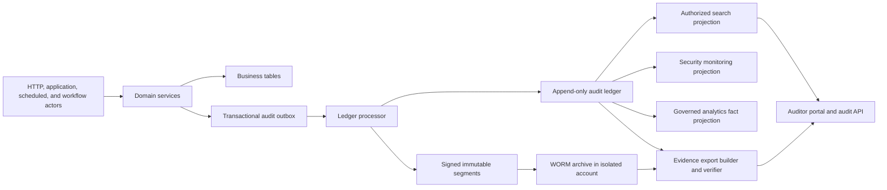

# Audit and Evidence Architecture

## Document Purpose

This document defines the high-level architecture for trustworthy auditing in DocuHyphen. It is
based on a review of the current backend, frontend, infrastructure, and
`ANALYTICS-ARCHITECTURE.md`.

The intended outcome is a complete, attributable, tenant-safe, tamper-evident audit trail that:

- Captures regulated business, security, administrative, and data-access activity.
- Lets authorized auditors sign in and review evidence without becoming administrators.
- Produces independently verifiable, immutable evidence exports.
- Supplies approved facts to analytics without making analytics the audit system of record.
- Detects capture, archival, integrity, retention, and access failures.

This architecture is not a claim that DocuHyphen complies with a particular law or industry
standard. Retention periods, legal-hold rules, required event categories, and access policies must
be selected with legal and compliance owners for each market.

## Executive Decision

DocuHyphen should replace its three disconnected audit mechanisms with one canonical Audit and
Evidence Platform.

Every regulated state change and sensitive read must create a durable audit intent in the same
transaction as the business operation. A ledger processor should canonicalize and append those
intents to an ordered, hash-chained ledger, then archive signed ledger segments to WORM storage.
Search, the auditor portal, evidence exports, security monitoring, and analytics should consume
projections from that ledger. They must not query mutable business tables and call the result an
audit trail.

The platform should have five logical boundaries:

1. Capture inside domain services.
2. Durable transactional audit outbox.
3. Canonical append-only audit ledger.
4. Immutable WORM evidence archive and integrity checkpoints.
5. Authorized read projections for auditors, monitoring, exports, and analytics.

## Current Project Assessment

### Useful Foundations Already Present

- `AuthAuditEvent` has event and previous-event hashes.
- `AuthAuditService` records many authentication and privileged administration events.
- `AccessAuditLog` defines useful actor, resource, organization, outcome, and snapshot fields.
- `DocumentAuditLog` captures some document creation, upload, metadata change, deletion, comment,
  and version creation activity.
- `APP_AUDITOR`, `ORG_AUDITOR`, `APP_AUDIT_READ`, and `ORG_AUDIT_READ` already exist in the role and
  capability model.
- Stable principal kinds, Resource References, owner contexts, centralized authorization, workflow
  runtime records, security incidents, and delivery logs provide strong inputs to a canonical event
  envelope.
- The analytics architecture already separates immutable operational facts from governed analytical
  projections and explicitly says analytics must not weaken audit evidence.

These are good ingredients, but they do not currently form an evidence system.

### Critical Current Gaps

| Area | Current evidence | Gap and consequence |
|---|---|---|
| Access audit | `AccessAuditLog` entity and repository exist | No service writes it. Share grants, changes, revocations, and most authorization decisions are absent. |
| Document access | Enum contains `VIEW` and `DOWNLOAD` | No code emits either action. Preview, current-version download, historical-version download, ZIP export, library download, and no-auth download are missing. |
| Exchange audit UI | Aggregates document logs for documents currently on the Exchange | It omits Exchange lifecycle, access, participant, workflow, Field, and deleted-document history. It also makes one request per current document. |
| Document audit authorization | The service checks that an Exchange and document separately exist | It does not prove that the document belongs to that Exchange and does not authorize audit access. Any authenticated caller may reach the resource. |
| Auditor roles | Auditor roles and capabilities are defined | `AuthAuditResource` allows only app or organization administrators. There is no auditor route or portal. |
| Auditor content boundary | `ORG_AUDITOR` currently receives `EXCHANGE_READ` and `DOCUMENT_READ` | Audit-evidence access is coupled to customer-content access. Standing auditor privilege should not automatically expose document content. |
| Audit API authorization | `AuthAuditResource` uses role helpers and membership repositories | It bypasses the centralized `APP_READ_AUDIT` and `ORG_READ_AUDIT` authorization actions, and a resource class performs scope decisions directly. |
| Audit scope | Organization scope uses the primary or first membership | It ignores the explicit active organization and cannot model a time-bound audit engagement or resource subset. |
| Immutability switch | `AuthAuditService` persists only when immutable auditing is enabled | Disabling the feature can remove the database evidence entirely, leaving only ordinary application logs. |
| Hash coverage | Auth hashes omit the event ID, actor role, target type, and target ID | Those persisted values can change without invalidating the hash. |
| Hash ordering | The latest hash is selected by timestamp before insert | Concurrent requests can select the same predecessor and fork the chain. Equal timestamps also make ordering ambiguous. |
| Database protection | Audit entities inherit normal save, update, and delete repository behavior | No database role, trigger, or privilege prevents update or deletion of audit rows. |
| WORM sink | Auth events are appended to a local daily JSONL file | Local application storage is not immutable, shared, or durable across ECS tasks. The sink catches failures and lets requests succeed. |
| WORM verification | `verifyDay` parses a chain | It does not compare the recomputed hash with the claimed hash, so it cannot establish integrity. Daily files also reset the line chain. |
| WORM completeness | Only auth events are mirrored | Document events, the unused access events, workflows, Fields, communications, and domain activity are excluded. |
| Event durability | `DomainEventPublisher` routes synchronously in process and catches failures | It is useful for notifications, but it is not a durable audit or analytical fact boundary. Events can be lost after business data commits. |
| Correlation | Some endpoints accept a client-provided `X-Request-Id` | There is no mandatory server-generated trace, correlation, or causation context across every domain and scheduled action. |
| Event content | Snapshots are free-form strings with regex redaction and truncation | Schema, classification, canonicalization, secret exclusion, and meaningful before/after changes are not guaranteed. |
| Audit access audit | Listing audit rows is not itself audited | Evidence viewing, searches, exports, verification, legal holds, and retention administration must all be attributable. |
| Export | No evidence export resource exists | Auditors cannot request, approve, download, or independently verify an evidence package. |
| Infrastructure | One document bucket, 30-day CloudWatch retention, and 7-day database backups are declared | There is no separate audit archive, Object Lock, audit KMS key, legal hold, integrity alarm, or archive replication boundary. |

### High-Risk Mutations Without Consistent Audit Capture

The repository review found direct or repository-mediated state changes without canonical audit
capture in the following service areas:

- Exchange lifecycle, metadata, permissions, no-auth access, participants, deletion, and rescission.
- Shares, inherited group Shares, constraints, role changes, activation, expiry, and revocation.
- Workflow Definitions, instances, step decisions, assignments, escalation, cancellation, condition
  evaluation, actions, and automated Exchange transitions.
- Field Definitions and Contract versions, Schema Definitions and versions, Schema Assignments, and
  Field Value changes.
- Blueprints, document-library entries and files, communication templates, variables, and sequences.
- User profile, email, phone, contacts, settings, password reset, sign-up, identity-provider linking,
  application token issuance, and some session cleanup activity.
- Organization settings, membership roles, policies, subscription policy, Principal Groups, and
  linked organizations, although some privileged paths already write auth audit events.
- Communication delivery, notifications, webhook outcomes, scheduled jobs, and storage operations.

The answer is not to add `AuthAuditService.emit` to every resource class. Capture belongs in the
application-scoped service that owns the business decision, in the same transaction as that
decision.

## Audit, Application Logs, Domain Events, and Analytics

These records serve different purposes and must not be conflated.

| Record | Purpose | Authoritative evidence | Mutable projection |
|---|---|---|---|
| Audit event | Reconstruct who did what, to which governed resource, when, why, and with what result | Yes, after ledger append and WORM checkpoint | No |
| Application log | Diagnose code and infrastructure behavior | No | Yes |
| Domain event | Coordinate business reactions and notifications | Only if durably captured through the outbox | Depends on transport |
| Security incident | Track an investigated security condition | It is a domain record whose lifecycle is audited | Yes |
| Analytical fact | Calculate approved metrics and trends | No, unless traced back to an audit event or other authoritative source | Yes and rebuildable |

Audit records are append-only. A correction is a new event that references and supersedes or
invalidates an earlier event. Analytics may rebuild its projections using the correction. Neither
system rewrites the original event.

## Target Architecture

### 1. Capture in Owning Services

Introduce one `AuditRecorder` service used by domain services. Resources remain thin HTTP adapters.
The recorder accepts a typed `AuditEventDraft`, derives trusted request and actor context, validates
the event type against a catalog, rejects prohibited payload fields, and writes an outbox row.

For a regulated mutation, the business change and outbox row commit or roll back together. No
privileged or regulated operation may succeed without a durable audit intent.

Sensitive reads such as document downloads, audit queries, evidence exports, secret metadata reads,
and bulk search need a short audit transaction before data is returned. The failure policy is
event-class based:

- Fail closed for regulated writes, document or evidence exports, privileged changes, and sensitive
  reads.
- Permit a documented degraded mode only for explicitly classified low-risk operations.
- Never silently discard an event. Surface health alerts and a machine-readable service state.

### 2. Transactional Audit Outbox

The outbox is a durable handoff, not the evidence ledger. It should contain immutable event drafts,
status, attempt count, occurrence time, and the business transaction identity. A unique event ID and
idempotency constraint prevent duplicate ledger events after retries.

The current synchronous `DomainEventPublisher` may continue to serve notifications initially, but
regulated facts must not depend on it. Longer term, the same transactional outbox can publish both
canonical audit work and approved domain notifications without creating competing facts.

### 3. Canonical Audit Ledger

Use a controlled, versioned event catalog and canonical JSON serialization. The ledger is append-only
and query-independent. Each event should include at least:

- Event ID, event type, category, outcome, schema version, and event catalog version.
- Occurrence time, server-recorded time, and ledger time in UTC.
- Stream ID and strictly increasing stream sequence.
- Actor kind and stable ID, delegated user where applicable, and system or workflow actor identity.
- Session ID, authentication method and strength, application ID, server trace ID, client request ID,
  correlation ID, and causation event ID where available.
- Source context such as IP address classification and normalized user-agent or device identity,
  subject to privacy policy.
- Owner context and Scope Reference captured at occurrence time.
- Primary Resource Reference and related Resource References.
- Action, outcome, stable reason code, required capability, authorization-decision reason, and the
  grant or policy basis where useful.
- Structured changed fields, before and after value hashes, and approved display metadata.
- Data classification, retention class, legal-hold eligibility, and source service version.
- Previous event hash, canonical event hash, signing key ID, and archive checkpoint reference.

Do not put passwords, OTPs, access or refresh tokens, API secrets, signing secrets, encryption keys,
raw document content, unrestricted webhook payloads, or unrestricted Field Values in audit events.
Prefer stable IDs, approved labels, changed-field names, byte counts, content hashes, and classified
value hashes. Sensitive readable evidence belongs in a separately protected payload envelope only
when compliance owners approve a concrete purpose.

### 4. Ordering and Tamper Evidence

A single global previous-hash lookup will fork under concurrency and become a throughput bottleneck.
Use ordered streams, normally one per owner scope and time partition. The ledger processor should
serialize appends per stream using a locked stream-head row or equivalent atomic compare-and-set.

Each event hash covers the complete canonical event, its sequence, and previous hash. Closed segments
contain a Merkle root or equivalent segment digest, first and last sequence, previous segment digest,
event count, schema versions, and signing key ID. Sign segment manifests with an asymmetric KMS or HSM
key. Archive both segment and manifest.

Database controls should deny update and delete to the application role. A separate migration or
retention role may perform only approved lifecycle operations. Database protection is defense in
depth; the external signed checkpoint is what makes privileged database rewriting detectable.

### 5. Immutable Evidence Archive

For the current AWS deployment, use a dedicated S3 bucket with versioning and Object Lock in
Compliance mode, encrypted with a dedicated KMS key. Prefer a separate security or evidence account,
separate write and read roles, denied public access, CloudTrail data events, and cross-Region or
cross-account replication according to the disaster-recovery requirement.

The application task may append evidence objects but should not have `DeleteObject`, retention
bypass, legal-hold administration, or broad list permissions. Auditor downloads must go through the
evidence service, not direct standing S3 credentials.

Legal holds and retention periods apply to immutable object versions. Retention configuration must
be tested in Governance mode outside production before Compliance mode is enabled because Compliance
retention cannot be shortened.

### 6. Search and Read Projections

Auditor search should use a tenant-aware read projection containing permitted event metadata and
approved display fields. It is rebuildable from the ledger and WORM archive. It is not the evidence
source and may be reindexed without changing history.

Every query independently authorizes:

1. The caller's audit capability.
2. The exact owner scope or audit engagement.
3. The event category and sensitivity.
4. The requested fields and output channel.
5. Any drill-down to the underlying domain resource.

The system must not infer audit scope from a user's primary organization. The requested organization
is explicit and checked against active membership, role assignment, engagement, and owner context.

## Auditor Access Architecture

Auditors should use the existing identity, SSO, MFA, session, risk, and step-up mechanisms. Do not
build a second login system.

### Roles and Capabilities

Keep roles convenient, but authorize every operation by capability. At minimum, separate:

- `ORG_AUDIT_READ` for organization-scoped event metadata.
- `ORG_AUDIT_EXPORT` for requesting an organization evidence export.
- `ORG_AUDIT_VIEW_SENSITIVE` for approved sensitive evidence fields.
- `APP_AUDIT_READ` for platform security and platform-operation events.
- `APP_AUDIT_EXPORT` for platform evidence exports.
- `AUDIT_EXPORT_APPROVE` for dual-control approval where required.
- `AUDIT_RETENTION_MANAGE` and `AUDIT_LEGAL_HOLD_MANAGE` for separately controlled governance.
- `AUDIT_INTEGRITY_VERIFY` for integrity reports and checkpoint verification.

Remove standing Exchange and document-content access from the default organization auditor role.
An auditor who genuinely needs source documents should receive a separate, explicit, time-bound
content grant. Platform auditors must not receive unrestricted customer-content access by standing
privilege, matching the analytics architecture.

### Audit Engagement

Model external or temporary reviews as an `AuditEngagement` resource with:

- Organization and optional Resource Reference scope.
- Auditor principals or approved group.
- Event categories and sensitivity level.
- Start, expiry, purpose, case or engagement reference, and legal basis.
- Export permission, maximum date range, and download limits.
- Requester, approver, revoker, and status.

Creating, approving, changing, expiring, and revoking an engagement are themselves privileged audit
events. Mandatory MFA and recent step-up should be required for sensitive evidence and exports.

### Auditor Portal

Add a dedicated protected route such as `/audit`, with role-sensitive views for:

- Search and filters.
- Event detail and related-event timeline.
- Integrity status and archive freshness.
- Export requests, approvals, status, and downloads.
- Active audit engagements.
- Retention and legal-hold status for separately authorized governance users.

The portal should default to metadata. Accessing snapshots, identities, IP data, or underlying
documents is a new authorization decision. Searches, event detail views, export requests, approvals,
downloads, failed access, and integrity checks are all audited.

### Audit Access Surfaces

The current product exposes audit information in only two contextual locations:

1. The Exchange `Audit` tab, which currently combines document audit rows for the documents still
   attached to the Exchange.
2. The document sidebar `Audit` tab, which shows audit rows for one document.

Keep both locations, but back them with filtered views of the canonical audit projection. They must
not maintain separate audit stores or define event meanings independently. Add the following access
surfaces as the audit product grows:

| Product location | Scope and purpose | Intended audience |
|---|---|---|
| Top-level `Audit` workspace at `/audit` | Primary organization or platform evidence search, integrity status, engagements, and exports | Organization auditors, platform auditors, and separately authorized compliance users |
| Exchange `Audit` tab | Complete timeline for one Exchange, including lifecycle, participants, Shares, documents, Fields, workflows, and automated actions | Exchange owners and authorized organization auditors, with field-level projection |
| Document sidebar `Audit` tab | Timeline filtered to one document and all its versions, including views, previews, downloads, comments, retention, and deletion | Users with document audit access and authorized auditors |
| Settings `Workflows` | Definition history for create, edit, publish, status, clone, and delete operations, plus links to execution evidence for instances created from that exact version | Workflow administrators and authorized auditors |
| Workflow instance detail | Evidence for triggers, assignments, decisions, escalations, actions, callbacks, and terminal results | Workflow administrators and authorized auditors |
| Other governed Settings areas | Contextual history for Fields, Schemas, Blueprints, Communications, Variables, Sequences, Document Library, organization members, Principal Groups, policies, IdP configuration, applications, and webhooks | Administrators of that resource and authorized auditors |
| Application and Integration Activity | Application credential, capability, webhook configuration, delivery, retry, callback, and failure evidence | Integration administrators and authorized auditors |
| Security and Access view | Authentication, sessions, MFA, denied access, role changes, security incidents, and sensitive access | Security administrators and auditors with sensitive-audit capability |
| Organization Settings `Audit and Compliance` entry | Link to the organization audit workspace, auditor assignments, engagements, retention policy, and legal holds | Organization owners and separately authorized governance users |
| Personal Account `Security Activity` | The signed-in user's own sign-ins, MFA changes, password resets, sessions, and security-driven revocations | The individual user only |
| Security incident detail | Events and immutable export references attached as evidence for one incident | Incident responders and authorized auditors |

Contextual views are convenience projections. The top-level Audit workspace is the primary place for
cross-resource investigation, compliance review, integrity verification, and evidence export.

#### Contextual Audit View Rule

Every governed resource that can be created, changed, published, activated, assigned, shared,
rotated, retired, or deleted should expose a nearby contextual `Audit` or `History` entry. A user
should not need to leave the resource and manually reconstruct filters in the top-level workspace.

For `Settings > Workflows`, provide two related contextual views:

- A Workflow Definition audit view, available from the definition list and designer, filtered by
  definition ID and version. It shows authoring, validation, publish, activation, clone, and deletion
  history with structured changed fields.
- A Workflow Instance audit view, available from instance dashboards and detail screens, filtered by
  instance ID. It shows runtime triggers, steps, assignments, decisions, escalations, conditions,
  actions, callbacks, and terminal results.

The definition view may link to instances created from that version, but authoring history and
runtime execution evidence must remain distinguishable. Editing version 3 of a Workflow Definition
must not visually rewrite the evidence for instances that ran version 2.

#### Settings Audit Coverage

The following Settings areas require both transactional audit capture and a contextual `Audit` or
`History` view:

| Settings area | Minimum changes that must be audited |
|---|---|
| Document Library | Entry creation, metadata change, file upload or replacement, publication, status change, clone, use by a Blueprint, download, archive, and deletion |
| Blueprints | Creation, metadata change, document defaults, participant defaults, Field defaults, Schema selection, publication, status change, clone, and deletion |
| Workflows | Definition creation, trigger and subject change, step addition or removal, step configuration, assignee rule, publication, activation, clone, and deletion, with runtime instance evidence kept separately |
| Sequences | Creation, format or scope change, counter reset, activation, deactivation, consumption where attribution matters, and deletion |
| Variables | Creation, scope change, value or template change, activation, deactivation, and deletion, with secret or sensitive values redacted or represented by hashes |
| Communications | Template creation, subject or body change, variable use, channel change, publication, status change, clone, and deletion, with delivery outcomes kept as related operational evidence |
| Organization `Administration` | Organization profile and settings changes, member invitations, additions and removals, role changes, Principal Groups, Exchange policies, session policy, subscription policy, IdP configuration, secret lifecycle, linked organizations, application access, auditor assignments, Audit Engagements, retention policy, and legal holds |

Every successful change, rejected or denied privileged attempt, automated administrative change,
and bulk settings operation should identify the actor, organization scope, exact settings resource,
outcome, reason, changed fields, previous and new value hashes, request context, and correlation or
causation context. Sensitive values and template bodies should not be copied into the general audit
payload.

Each Settings tab should provide:

- A resource-level audit view from the selected row, card, or designer.
- A tab-level `Recent changes` view covering resources in that Settings area.
- A link that opens the same authorized filter in the top-level Audit workspace.
- Export controls only when the caller has audit-export capability.

The contextual view is scoped to the selected resource and uses the canonical audit projection. It
does not create or query a separate Settings audit table. Being allowed to administer a Settings
resource does not automatically grant access to sensitive audit fields or evidence exports.

Opening an Exchange or document must not automatically reveal all audit fields. Ordinary resource
access and audit-evidence access remain separate decisions. For example:

- An Exchange participant may see a small activity timeline needed for collaboration, but not IP
  addresses, authorization denials, internal comments, auditor activity, or organization-wide events.
- An Exchange owner may see the full Exchange-scoped business timeline but not unrelated security
  events or protected identity details.
- An organization auditor may search organization-scoped evidence but does not receive document
  content unless separately granted.
- A platform auditor sees platform security and operational evidence without standing access to
  customer document content.
- A user sees only their own personal security activity.

Each surface should use the same event-detail component, event display catalog, redaction policy,
cursor pagination, and authorization service. A deep link from a contextual view to the top-level
workspace must reauthorize the destination scope.

## REST Resource Shape

Keep resources plural and tenant scope explicit. A suitable high-level API is:

- `GET /organizations/{organizationId}/audit-events`
- `GET /organizations/{organizationId}/audit-events/{eventId}`
- `POST /organizations/{organizationId}/audit-exports`
- `GET /organizations/{organizationId}/audit-exports`
- `GET /organizations/{organizationId}/audit-exports/{exportId}`
- `POST /organizations/{organizationId}/audit-exports/{exportId}/approvals`
- `GET /organizations/{organizationId}/audit-exports/{exportId}/file`
- `GET /organizations/{organizationId}/audit-integrity`
- `POST /organizations/{organizationId}/audit-engagements`
- `GET /organizations/{organizationId}/audit-engagements`
- `PATCH /organizations/{organizationId}/audit-engagements/{engagementId}/status`
- `GET /exchanges/{exchangeId}/audit-events`
- `GET /exchanges/{exchangeId}/documents/{documentId}/audit-events`
- `GET /workflows/definitions/{workflowDefinitionId}/audit-events`
- `GET /workflow-instances/{workflowInstanceId}/audit-events`
- `GET /applications/{applicationId}/audit-events`
- `GET /security-incidents/{securityIncidentId}/audit-events`
- `GET /users/me/security-events`
- `GET /platform/audit-events`
- `POST /platform/audit-exports`

Use cursor pagination over immutable sequence and event ID, not offset pagination. Enforce bounded
date ranges, approved filters, rate limits, and asynchronous export generation. Contextual resources
query the same authorized projection as the organization and platform resources, with a mandatory
Resource Reference filter.

## Verifiable Evidence Exports

An export is an asynchronous governed resource with states such as `REQUESTED`,
`APPROVAL_PENDING`, `BUILDING`, `READY`, `EXPIRED`, `FAILED`, and `REVOKED`.

The export builder should first verify the relevant ledger and archive checkpoints. A bundle should
contain:

- `manifest.json` with export ID, scope, filters, filter digest, occurrence range, generation time,
  requester, approver, event count, first and last sequence and hash, segment digests, schema
  versions, redactions, application version, and signing key ID.
- `events.jsonl` as the canonical machine-readable evidence.
- `events.csv` as a convenience view with explicit loss-of-fidelity notes.
- `integrity.json` with chain, segment, archive, and checkpoint verification results.
- A detached manifest signature and public verification material or key references.
- An optional human-readable PDF summary that is never represented as the canonical evidence.
- A README describing formats, time semantics, redactions, verification, and limitations.

The final archive should have a bundle digest and short download lifetime. The original ledger and
WORM segments remain the source evidence. Export creation, approval, completion, download, expiry,
verification, and failure each create audit events.

Include the predecessor hash and signed boundary checkpoints needed to verify a selected range. A
range must not appear valid merely because the events inside the range link to each other.

## Required Audit Coverage Catalog

The event catalog should use stable namespaced keys and explicit outcomes. The following is the
minimum project coverage found during this review.

### Identity, Authentication, and Sessions

- Sign-up initiation, verification, completion, rejection, retry limit, and account creation.
- Sign-in lookup, initiation, MFA challenge, success, failure, lockout, and risk decision.
- Password reset request, validation failure, completion, and session revocation after reset.
- OAuth initiation, callback, link, unlink, failure, and identity collision.
- Application credential authentication and token issuance success or failure.
- Access-token rejection reasons, DPoP failure, session-version mismatch, membership invalidation,
  idle timeout, absolute expiry, refresh rotation, replay, and family revocation.
- Session creation, refresh, logout, logout-all, administrator revocation, expiry, and deletion.
- MFA enrollment, challenge delivery, regeneration, verification, recovery, change, and removal.
- Email, phone, password, profile, contact, and notification-security setting changes.
- SCIM provisioning, update, deprovisioning, reactivation, and rejected operation.

### Authorization and Sharing

- Authorization denials for protected actions and allows for sensitive reads or privileged actions.
- Exchange Share grant, activation, inherited materialization, role or constraint change, expiry, and
  revocation.
- Share-link creation, successful and failed use, use-count change, expiry, and revocation.
- App role, organization role, group role, application capability, and policy changes.
- Principal Group creation, update, membership addition or removal, deactivation, and deletion.
- Audit access, sensitive drill-down, and cross-organization denial.

Do not record every successful ordinary read merely because authorization ran. Audit sensitive
content access, bulk access, unusual access, public-link access, privileged access, and all denies
according to the approved event policy.

### Exchanges and Participants

- Exchange creation, blueprint use, initial owner and recipient grants, and creation failure.
- Name, description, recipient-sign-in rule, no-auth validity, document constraints, and allowed
  format changes.
- Lifecycle transition requested, workflow-gated, approved, rejected, started, ended, rescinded,
  deleted, restored if supported, or blocked.
- Participant add, remove, identity resolution, invitation, acceptance, rejection, and no-auth
  access-code request or verification.
- Ownership or owner-context change and linked-organization policy decision.
- Bulk search or export where it reveals regulated Exchange metadata.

### Documents, Versions, Comments, and Storage

- Document request creation, metadata update, requirement change, archive, soft delete, and permanent
  deletion.
- Upload attempted, succeeded, failed, malware or type rejection, stored-byte count, content hash,
  encryption mode, and storage key reference.
- View, preview, download, historical-version download, ZIP download, library download, and no-auth
  download with human, application, public-link, and workflow actors distinguished.
- Version creation, replacement, comparison, restore if supported, and stored-byte delta.
- Comment creation and any future edit or deletion, including the internal-comment classification.
- Retention placement, legal hold, release, storage deletion, restore, replication, and integrity
  failure.

### Workflows and Automation

- Workflow Definition creation, update, clone, publish, unpublish, activation, deactivation, and
  deletion.
- Instance trigger requested, matched, not matched, started, cancelled, failed, and completed.
- Step activation, assignment, reassignment, decision, quorum result, escalation, timeout, addon
  execution, and terminal state.
- Condition input references and result without leaking prohibited values.
- Action start and outcome, including auto-accept, access revocation, reminders, and webhook action.
- Every automated event identifies the workflow instance and step as actor or causation context.
- Scheduler start, completion, partial failure, recovery, and backlog.

### Fields, Schemas, Templates, and Configuration

- Field Definition creation and retirement, Field Contract version creation, classification and
  reportability changes.
- Schema creation, draft version, binding change, compatibility decision, publish, and retirement.
- Schema Assignment and unassignment, Field Value create, update, delete, provenance change, and
  validation rejection.
- Blueprint, communication template, variable, sequence, and document-library create, change,
  publish, status change, clone, reset, file access, and delete.
- Organization settings, session policy, exchange policy, subscription policy, IdP configuration,
  secret lifecycle, and linked-organization changes.

For sensitive Field Values, capture the binding, contract version, classification, change type, and
before or after hashes. Store readable values only when an approved evidence purpose requires them.

### Integrations, Communications, and Operational Security

- Application registration, credential rotation, capability change, deactivation, and token use.
- Webhook endpoint registration, enablement, disablement, secret rotation, delivery attempt, retry,
  callback, timeout, dead-letter, and egress-policy rejection.
- Communication queued, rendered, sent, delivered, suppressed, retried, and failed, without copying
  message bodies into the general ledger.
- Security incident creation, severity or status change, assignment, resolution, and evidence link.
- Audit configuration change, capture failure, outbox lag, archive failure, sequence gap, signature
  failure, verification run, retention action, legal hold, backup, restore, and privileged
  infrastructure access.

Infrastructure events such as S3 Object Lock changes, KMS key administration, CloudTrail changes,
database administrator access, deployment, and backup restoration come from AWS and database audit
sources. Import or correlate them into the security view while preserving their original signed or
provider evidence.

## Analytics Integration

The analytics plan identifies document access, Exchange transitions, workflow states and decisions,
permission changes, authentication and security activity, delivery outcomes, storage changes, and
Field changes as valuable facts. Those are also core audit events.

Use one capture at the domain boundary, then project approved audit events into the canonical
analytical fact boundary. Do not make each domain service emit one audit event and a separate,
independently defined analytical event for the same occurrence.

The analytical projector must:

- Be idempotent by audit event ID.
- Preserve occurrence, recorded, and processing time.
- Preserve principal kind, owner context, Resource References, correlation, and schema versions.
- Copy only approved dimensions and measures.
- Exclude secrets, unrestricted payloads, raw snapshots, restricted Field Values, and unnecessary
  identities.
- Apply corrections and invalidations by rebuilding or adjusting projections, never by changing the
  audit event.
- Expose ledger and projection freshness separately.

Not every audit event belongs in analytics. Integrity verification, auditor searches, and evidence
downloads are normally security metrics, not general operational analytics. Not every analytical
fact must be an audit event either. Periodic inventory observations may remain analytical facts when
they are not regulated occurrences. Both models should reuse stable identities and owner context.

Analytics exports and evidence exports are different products. Analytics exports contain authorized
reporting results. Evidence exports contain verifiable source events and integrity material.

## Retention, Privacy, and Legal Hold

Define retention by event class and owner policy, subject to platform minimums and applicable law.
Do not hard-code a universal number of years in the architecture.

The retention catalog should define:

- Event class and purpose.
- Minimum, default, and maximum retention.
- Organization override rules.
- WORM retention and searchable-projection retention.
- Identity and IP treatment.
- Legal-hold eligibility.
- Export lifetime and disposal.
- Deletion, anonymization, and crypto-shredding behavior.
- Long-term format and key-verification requirements.

Legal hold overrides ordinary disposal. Deleting a user, participant, organization, Exchange, or
document does not silently delete its compliance history. Where identity is no longer required, use
approved pseudonymization or a protected identity-vault reference while preserving event integrity.

## Monitoring and Control Evidence

Operate auditing as a production subsystem with objectives and alerts for:

- Outbox oldest age, depth, retry count, and dead letters.
- Ledger append latency, duplicates, sequence gaps, and stream forks.
- Archive age, failed Object Lock retention, replication lag, and missing segments.
- Scheduled end-to-end chain and signature verification.
- Search-projection lag and rebuild status.
- Clock synchronization and timestamp drift.
- Storage capacity and retention-policy failures.
- Repeated authorization denies, unusual exports, and auditor access anomalies.
- Percentage of cataloged regulated operations with tested audit coverage.

Integrity verification results must themselves be immutable audit events and externally alert when
they fail. A green dashboard derived only from the same mutable database is insufficient.

## Delivery Sequence

### Phase 1: Establish the Trust Boundary

- Approve the event and retention catalogs.
- Add trusted request, correlation, causation, actor, session, and owner context.
- Build the typed recorder and transactional outbox.
- Make capture mandatory for the first regulated operations.
- Add database append-only privileges and integrity tests.

### Phase 2: Unify Existing Coverage

- Migrate auth audit emission to the canonical recorder.
- Replace document audit writes and add missing views and downloads.
- Implement Share and authorization audit capture.
- Cover Exchange lifecycle, workflows, memberships, roles, Fields, Schemas, and applications.
- Keep compatibility projections for the current Exchange audit UI during migration.

### Phase 3: Immutable Archive and Verification

- Add the isolated Object Lock archive and KMS signing key.
- Implement ordered stream appends, signed segments, external checkpoints, replication, and alarms.
- Run continuous verification and disaster-recovery retrieval tests.
- Import existing audit rows as explicitly marked legacy events without pretending they have full
  provenance or historical immutability.

### Phase 4: Auditor Product

- Correct auditor capability assignments and remove implicit content access.
- Add Audit Engagements, auditor portal, tenant-safe search, sensitive-field projection, and step-up.
- Add asynchronous, signed evidence exports and offline verification tooling.
- Audit all evidence access and governance actions.

### Phase 5: Analytics and Assurance

- Project approved audit facts into analytics.
- Reconcile analytical measures against authoritative event counts.
- Add coverage tests to every regulated service operation.
- Produce control evidence for capture health, retention, access reviews, integrity verification, and
  recovery exercises.

## Required Tests

- A regulated mutation rolls back when its audit intent cannot persist.
- A committed mutation always has exactly one canonical audit event after retry processing.
- Concurrent appends cannot fork or reorder an audit stream.
- Changing any canonical field, sequence, predecessor, segment, or manifest breaks verification.
- Deleting, inserting, reordering, or truncating a range is detected through boundary checkpoints.
- The application database role cannot update or delete ledger rows.
- WORM objects cannot be overwritten or deleted before retention expiry.
- Organization auditors cannot cross organization boundaries or gain document content by role alone.
- Platform auditors cannot read customer content without a separate grant.
- Audit searches, detail views, denied attempts, exports, downloads, and legal-hold actions are audited.
- Exported bundles verify offline and disclose redactions and schema versions.
- Analytics replay is idempotent and never copies prohibited fields.
- Deleted resources and users do not erase required evidence or break historical rendering.

## Decisions Required Before Implementation Planning

- Target regulated industries and jurisdictions for the first release.
- Required event classes and event-level failure policy.
- Retention, legal hold, residency, replication, and destruction rules.
- Organization auditor, external auditor, platform auditor, support, and compliance-officer boundaries.
- Whether every evidence export requires dual approval or only sensitive and broad exports.
- Which audit fields are readable, masked, pseudonymized, or prohibited by audience.
- Ordered-stream partition and segment-closing policy.
- Online search window versus archive-only history.
- Required archive and projection freshness objectives.
- Offline verifier distribution and public-key trust model.
- Treatment of existing unauthenticated Exchange access and external participant identity.
- Migration cutover date after which the canonical ledger is considered complete evidence.

## Standards Alignment

The design supports the intent of NIST SP 800-53 Rev. 5 Audit and Accountability controls,
especially event selection, record content, failure response, review, time correlation, audit
protection, retention, and generation. NIST SP 800-92 provides the broader log-management lifecycle.
OWASP logging guidance reinforces consistent event classification, protected collection, verification,
and exclusion of secrets. AWS documents S3 Object Lock Compliance mode as WORM protection that
prevents protected object versions from being overwritten or deleted, including by the account root
user, until retention expires.

Primary references:

- [NIST SP 800-53 Rev. 5](https://csrc.nist.gov/Pubs/sp/800/53/r5/upd1/Final)
- [NIST SP 800-92](https://csrc.nist.gov/pubs/sp/800/92/final)
- [OWASP Logging Cheat Sheet](https://cheatsheetseries.owasp.org/cheatsheets/Logging_Cheat_Sheet.html)
- [AWS S3 Object Lock](https://docs.aws.amazon.com/AmazonS3/latest/userguide/object-lock.html)

## Success Criteria

This architecture is successful when:

- Every approved regulated occurrence has one tested capture point in its owning service.
- Business success cannot silently occur without its required durable audit intent.
- Audit events remain attributable to human, application, workflow, service, and system actors.
- Tenant and owner scope are captured at occurrence time and enforced on every read and export.
- Concurrent processing cannot fork the ordered ledger.
- Database or application compromise cannot rewrite history without detection at an external signed
  checkpoint.
- Auditors can sign in, review only their approved scope, and download independently verifiable
  evidence without administrator privileges.
- Evidence access is itself visible and attributable.
- Analytics reuses approved facts without becoming the evidence system or leaking restricted data.
- Retention, legal hold, verification, export, and recovery controls produce their own reviewable
  evidence.
