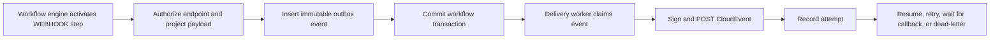

# DocuHyphen Webhook and Application Integrations Feature Design

## Status

Implementation design for review.

This document defines the organization Integrations settings experience, registered external
applications, outbound workflow webhooks, durable delivery, and authenticated application callbacks
that can perform authorized Exchange actions.

This design depends on authorization foundations that are now complete: the `APPLICATION` principal,
scope-safe capabilities, stable Exchange ownership, centralized resource authorization, and a human
`OWNER` for application-initiated Exchanges.

## Product Goal

An organization can connect an external application, configure a verified webhook destination, and
select that destination from the Workflow Designer. When a workflow reaches a `WEBHOOK` step,
DocuHyphen creates a durable CloudEvent and delivers it asynchronously.

The receiving application may use the event as a notification or may call the DocuHyphen REST API
to perform an explicitly authorized Exchange action. Receiving a webhook does not itself grant API
access. The application authenticates independently, and every API action passes normal capability,
owner-context, resource, lifecycle, Share-constraint, concurrency, and idempotency checks.

## Primary Scenarios

### CLM review request

Acme configures its CLM as an `APPLICATION` and registers a verified webhook endpoint. A workflow
sends a review-request CloudEvent when an Exchange reaches Legal review. The CLM downloads permitted
metadata through the REST API, records its review result through an authorized Exchange endpoint,
and DocuHyphen resumes the waiting workflow.

### Document processing

An HR application receives a webhook that references a newly uploaded Exchange document. The
application has permission to read that document and upload a derived version. It calls the existing
document REST resources with an idempotency key and Exchange version. The human Exchange `OWNER`
continues to control access, rescind, and end actions.

### Notification-only integration

A procurement system receives a webhook when an Exchange becomes active. The workflow continues as
soon as the event is durably queued. The procurement system has no Exchange mutation capability and
uses the event only to update its own status.

### Delivery-gated workflow

A workflow sends a webhook to an archival system and waits until that endpoint accepts delivery. The
step completes after a successful HTTP response. Exhausted retries pause the workflow for an
administrator instead of silently losing the integration event.

## Design Decisions

### Settings label

Use the plural label `Integrations`.

Place it in Settings under the `Organization` divider, immediately below `Administration` and above
`Billing`.

`Integrations` is a single Settings navigation item. Selecting it opens an organization Integrations
page with a horizontal tab list, following the existing `OrganizationTab` pattern used by
`Administration`. The page contains these tabs:

1. Connected Apps
2. API Applications
3. Webhooks
4. Activity

Applications are the configuration ownership root. Webhooks are created and managed inside a
specific application, for example:

`Organization > Integrations > API Applications > Acme CLM > Webhooks`

The main `Webhooks` tab is an application-grouped index and navigation shortcut. It does not create
an organization-wide webhook configuration model and does not allow a webhook to exist without an
owning application.

The main `Activity` tab provides a combined operational view using the same integration permission
boundary. Each application detail also includes its own filtered Activity view.

### A webhook is a workflow step

Add `WEBHOOK` to `WorkflowStepType`. Do not model webhook delivery as a normal `ACTION` handler.

The current `WorkflowActionHandler.execute` contract runs inside the workflow step transaction and
returns synchronously. Network calls, retries, backoff, endpoint throttling, and waiting for an
external callback do not belong in that transaction.

A `WEBHOOK` step creates a durable outbox event. A separate worker performs HTTP delivery outside the
workflow transaction and reports the result back through `WorkflowEngineService` methods.

Do not add webhook delivery as a `NotificationChannel`. The current notification dispatcher is
user-recipient oriented and applies notification preferences and fallback channels. Workflow
webhooks target registered applications, have different authorization and retry semantics, and can
block or resume workflow execution. They require a dedicated delivery pipeline while reusing shared
event, audit, and observability conventions where appropriate.

### Webhooks report facts; REST endpoints perform commands

The receiving application must not mutate an Exchange by returning instructions in the webhook HTTP
response. Its webhook response acknowledges delivery only.

To perform an action, the application calls the appropriate DocuHyphen REST resource using its own
access token. Examples include uploading a document, recording an external decision, updating an
allowed Exchange property, or retrieving current status.

### CloudEvents v1.0.2 structured JSON

Use CloudEvents v1.0.2 structured JSON with:

`Content-Type: application/cloudevents+json; charset=utf-8`

Required attributes:

- `specversion`
- `id`
- `source`
- `type`

Supported optional attributes:

- `subject`
- `time`
- `datacontenttype`
- `dataschema`

DocuHyphen extension attributes must use lowercase ASCII names no longer than 20 characters. Initial
extensions are:

- `orgid`
- `workflowid`
- `stepid`
- `deliveryid`
- `correlationid`

### Thin payloads by default

Webhook payloads contain stable references and a minimal state summary. They do not contain document
bytes, unrestricted Exchange DTOs, secrets, recipient lists, or all future Field Values.

The external application fetches additional data through authorized REST endpoints. This keeps the
webhook contract small and ensures current access is evaluated when sensitive data is requested.

### At-least-once delivery

Delivery is at least once. Automatic retries use the same CloudEvent `source` and `id` and the same
immutable serialized body. Receivers must deduplicate on `source` plus `id`.

DocuHyphen guarantees durable event creation, not exactly-once processing by an external system.

### Human ownership remains mandatory

Every application-initiated Exchange must assign at least one active human `OWNER` transactionally.
The registered application is the initiating principal, while the human owner controls lifecycle and
access management.

An application can perform only the Exchange actions granted to it. It never inherits the human
`OWNER` role from a workflow, webhook endpoint, delivery, or callback correlation ID.

## Current Architecture Findings

The implementation must account for these existing behaviors:

- `Settings.tsx` currently renders `Administration` and `Billing` under the Organization divider and
  performs a direct role-string check.
- `Application` already stores machine credentials, but it is not organization-owned and currently
  stores an API secret directly. It must be refactored rather than duplicated by a parallel machine
  identity.
- `ApplicationTokenBoundaryService` limits application tokens using scopes and endpoint prefixes.
  Those checks are token boundaries, not business authorization.
- `DomainEvent` already has useful event ID, type, actor, subject, organization, occurrence time, and
  payload concepts, but it is not the external webhook contract.
- `DomainEventPublisher` and `EventRouter` are currently synchronous. The source comments already
  anticipate a future durable transport.
- `WorkflowActionHandler.execute` runs inside the workflow transaction and has no automatic retry.
- `WorkflowStepSpec` snapshots each step into `WorkflowStepInstance.specSnapshotJson`, which is the
  correct foundation for stable webhook execution.
- `StepCard.tsx` already exceeds the preferred component size. It must be split before webhook
  editing is added.
- `WorkflowStepStatus` has no delivery or callback waiting state.

## User Experience

### Organization Settings Navigation

Update `web-app/src/app/settings/Settings.tsx` and follow the existing Administration page pattern:

- Add one `Integrations` navigation item below `Administration` and above `Billing`.
- Selecting `Integrations` renders a dedicated `IntegrationsTab` page.
- Inside that page, add a horizontal Fluent UI `TabList` with Connected Apps, API Applications,
  Webhooks, and Activity tabs.
- Keep the selected inner tab as page-local state, consistent with `OrganizationTab`.
- Make the horizontal tab list responsive and usable in the mobile Settings drawer layout.
- Add an Integrations navigation icon to `IconBundles.tsx`.
- Replace direct role-string authorization with effective capabilities from the hardened session
  contract.

The navigation order becomes:

1. Administration
2. Integrations
3. Billing

The Integrations page tab order is:

1. Connected Apps
2. API Applications
3. Webhooks
4. Activity

The Integrations navigation item is visible when the user has at least one of:

- `INTEGRATION_VIEW`
- `INTEGRATION_MANAGE`

All Integrations page tabs use the same two human-facing capability boundaries. `INTEGRATION_VIEW`
allows navigation and redacted viewing. `INTEGRATION_MANAGE` allows configuration and operational
actions. Hiding a control never replaces backend authorization.

### Integrations Layout

Create:

```text
web-app/src/app/settings/integrations-tab/
  IntegrationsTab.tsx
  IntegrationsTabStyles.tsx
  connected-apps-tab/
    ConnectedAppsTab.tsx
    ConnectedAppsTabStyles.tsx
    ConnectedAppDetail.tsx
    ConnectedAppDetailStyles.tsx
  api-applications-tab/
    ApiApplicationsTab.tsx
    ApiApplicationsTabStyles.tsx
    ApplicationEditorDialog.tsx
    ApplicationEditorDialogStyles.tsx
    ApplicationCredentialDialog.tsx
    ApplicationCredentialDialogStyles.tsx
  application-detail/
    IntegrationApplicationDetail.tsx
    IntegrationApplicationDetailStyles.tsx
    ApplicationOverviewTab.tsx
    ApplicationAuthenticationTab.tsx
    ApplicationPermissionsTab.tsx
    ApplicationWebhooksTab.tsx
    ApplicationActivityTab.tsx
  webhooks-tab/
    WebhooksTab.tsx
    WebhooksTabStyles.tsx
    ApplicationWebhookGroup.tsx
  activity-tab/
    IntegrationActivityTab.tsx
    IntegrationActivityTabStyles.tsx
    WebhookDeliveryDetailDrawer.tsx
    WebhookDeliveryDetailDrawerStyles.tsx
  webhook-editor/
    WebhookEndpointEditorDialog.tsx
    WebhookEndpointEditorDialogStyles.tsx
    WebhookSecretRotationDialog.tsx
    WebhookSecretRotationDialogStyles.tsx
```

Every component must follow the repository frontend rules:

- Keep TSX components under approximately 150 lines by splitting focused child components.
- Keep all static styling in co-located `*Styles.tsx` files.
- Add stable IDs to rendered components and interactive controls.
- Use circular Fluent UI buttons.
- Put attributes on separate lines when a component has multiple attributes.
- Support desktop, tablet, and mobile layouts.
- Use cards on narrow screens instead of forcing wide tables.

#### Connected Apps

Connected Apps represents provider-managed connections such as Teams, Slack, and Dropbox. A
connection has an owning organization, provider, authentication state, granted provider permissions,
and provider-specific workflow actions.

The first webhook release does not need to implement every provider connector. The structure must
allow providers to be added without treating every provider connection as a generic API application.

#### API Applications

Show:

- Application name
- Status
- Organization
- Default human Exchange owner
- Authentication method
- Granted capabilities summary
- Credential or public-key version
- Last authenticated time
- Created by and created time

Actions:

- Register application
- Edit application
- Change default human owner
- Review capability grants
- Rotate credentials or keys
- Suspend
- Reactivate
- Revoke

Secrets are displayed only once at creation or rotation. The frontend must never receive stored
secret material again.

Selecting an application opens application detail with:

1. Overview
2. Authentication
3. Permissions
4. Webhooks
5. Activity

#### Application Webhooks

Webhook creation and management occurs only inside the selected application's Webhooks tab. The
canonical path is:

`Organization > Integrations > API Applications > Acme CLM > Webhooks`

Show:

- Endpoint name
- URL host and path
- Status
- Verification status
- Signing method
- Active signing-key version
- Allowed request rate
- Last successful delivery
- Last failure
- Referencing workflow count

Actions:

- Add endpoint
- Edit endpoint metadata and URL
- Verify endpoint
- Send test delivery
- Rotate signing secret
- Disable or enable
- Delete when no active workflow definition references it

Endpoint editor fields:

- Name
- HTTPS URL
- Description
- Signing method, initially `HTTP_MESSAGE_SIGNATURE_HMAC_SHA256`
- Requested delivery rate per minute
- Default timeout, constrained by platform limits
- Default retry policy

Do not support arbitrary user-defined outbound headers in the first release. They are difficult to
classify, redact, rotate, and audit safely.

The application Webhooks tab includes endpoint configuration followed by webhook activity filtered
to the selected application. Users do not need to leave the application to inspect delivery status,
failures, retries, callbacks, or referencing workflows.

#### Main Webhooks index

The main `Organization > Integrations > Webhooks` tab groups endpoints by owning Connected App or API Application.
It is a navigation and dependency overview, not a second configuration surface.

It shows application name, endpoint count, failed delivery count, and referencing workflow count.
Selecting an endpoint opens its owning application directly on the Webhooks tab. New webhook actions
must first select or create an application.

#### Activity

`Organization > Integrations > Activity` provides an optional combined operational view across the organization's
applications. It uses the same `INTEGRATION_VIEW` and `INTEGRATION_MANAGE` checks as the rest of the
Integrations page and does not introduce another role family.

Each application detail exposes the same delivery data pre-filtered to that application.

Filters:

- Application
- Endpoint
- Workflow definition
- Workflow instance
- Exchange ID
- Event type
- Delivery status
- Date range

List columns:

- Delivery ID
- Event type
- Endpoint
- Exchange
- Workflow
- Status
- Attempts
- Last HTTP status
- Created time
- Last attempt time
- Next retry time

Delivery detail shows metadata, a redacted payload preview, signature key version, attempt timeline,
latency, response status, and redacted error details.

An authorized administrator may request redelivery. Redelivery uses the immutable event body and the
current active endpoint configuration. Before redelivery, DocuHyphen revalidates endpoint ownership,
application status, and whether the historical payload is still permitted. If current policy would
forbid the stored payload, redelivery is denied.

## Application Registration and Authorization

Refactor the existing `Application` entity into the canonical machine identity. Do not create a
second credential identity specifically for webhooks.

Required application data:

- `id`
- `organizationId`
- `name`
- `description`
- `applicationType`, using `INTEGRATION` for external integrations
- `status`
- `defaultOwnerAppUserId`
- `clientId`
- `authenticationMethod`
- public-key or protected credential metadata
- `lastAuthenticatedAt`
- `createdByAppUserId`
- `createdAt`
- `updatedAt`

Add `APPLICATION` to `PrincipalKind` and ensure application tokens resolve to
`PrincipalRef(APPLICATION, applicationId)`.

Recommended inbound authentication order:

1. OAuth client credentials using `private_key_jwt`
2. Mutual TLS where customer infrastructure supports it
3. A transitional client secret only when asymmetric authentication is unavailable

Access tokens must be short lived and contain or resolve:

- application principal ID
- organization boundary
- token audience
- token expiry
- maximum token scopes

Token scopes restrict the token boundary. Server-side capability grants remain authoritative.

An application initiation request may select a different human owner only when that person is an
active member of the same organization and the application is permitted to nominate owners. If no
owner is supplied, use `defaultOwnerAppUserId`. Initiation fails transactionally if no valid human
owner can be resolved.

## Capabilities

Keep human integration administration intentionally simple with two capabilities:

- `INTEGRATION_VIEW`
- `INTEGRATION_MANAGE`

`INTEGRATION_VIEW` covers Connected Apps, API Applications, application-owned webhook metadata, and
redacted activity. `INTEGRATION_MANAGE` covers application registration, provider connection setup,
credentials, application capability grants, webhook configuration, verification, secret rotation,
test delivery, suspension, and redelivery. High-risk actions still require fresh authentication,
confirmation, and audit, but do not introduce more user-facing integration roles.

Application business capabilities remain distinct, for example:

- `EXCHANGE_INITIATE`
- `EXCHANGE_READ`
- `EXCHANGE_WRITE`
- `EXCHANGE_DOCUMENT_READ`
- `EXCHANGE_DOCUMENT_UPLOAD`
- `EXCHANGE_RESCIND`

`ORG_OWNER` and explicitly approved `ORG_ADMIN` combinations may manage integrations. Billing,
auditor, member, and guest roles receive no integration mutation capability by default.

`ORG_AUDITOR` may receive `INTEGRATION_VIEW` when organization policy allows it. Read views must
redact headers, response bodies, payload values, and all secrets. Only `INTEGRATION_MANAGE` may
request operational changes, and secrets are never readable after creation or rotation.

## Persistence Design

Create one new Flyway migration after the latest migration version at implementation time. Do not
edit an already-applied migration.

### `application`

Refactor or migrate the existing table so organization integration applications have:

- `organization_id uuid not null` for `INTEGRATION` applications
- `default_owner_app_user_id uuid not null` for applications allowed to initiate Exchanges
- `status varchar(32) not null`
- `client_id varchar(255) not null`
- `authentication_method varchar(32) not null`
- protected credential or public-key reference fields
- `created_by_app_user_id uuid`
- `updated_at timestamp not null`

Remove plaintext reusable API secrets after the clean-break migration. If a symmetric client secret
is temporarily supported, store only a slow credential hash because DocuHyphen only verifies it.

### `application_capability_grant`

Columns:

- `id uuid primary key`
- `application_id uuid not null`
- `organization_id uuid not null`
- `capability varchar(128) not null`
- `status varchar(32) not null`
- `granted_by_app_user_id uuid not null`
- `granted_at timestamp not null`
- `revoked_by_app_user_id uuid`
- `revoked_at timestamp`

Unique active grant constraint on application, organization, and capability.

### `webhook_endpoint`

Columns:

- `id uuid primary key`
- `organization_id uuid not null`
- `application_id uuid not null`
- `name varchar(255) not null`
- `description text`
- `url text not null`
- `config_version integer not null`
- `status varchar(32) not null`
- `verification_status varchar(32) not null`
- `verified_at timestamp`
- `verified_origin varchar(255)`
- `allowed_rate_per_minute integer`
- `signing_method varchar(64) not null`
- `active_signing_key_version integer not null`
- `timeout_seconds integer not null`
- `max_attempts integer not null`
- `created_by_app_user_id uuid not null`
- `created_at timestamp not null`
- `updated_at timestamp not null`

Unique endpoint name per organization. Index organization, application, and status.

Increment `config_version` whenever URL, signing method, timeout, rate, or retry configuration
changes. Changing the URL clears verification and disables delivery until the new exact URL passes
verification.

### `webhook_signing_key`

Columns:

- `id uuid primary key`
- `endpoint_id uuid not null`
- `endpoint_config_version integer not null`
- `destination_url text not null`
- `key_version integer not null`
- `encrypted_key_material text not null`
- `kms_key_reference varchar(512)`
- `status varchar(32) not null`
- `valid_from timestamp not null`
- `valid_until timestamp`
- `created_by_app_user_id uuid not null`
- `created_at timestamp not null`

The signing key must remain decryptable by the delivery worker, so hashing alone is insufficient.
Use envelope encryption or the deployment secret manager. Rotation may retain the previous key for a
short, explicit overlap window.

### `webhook_outbox_event`

Columns:

- `id uuid primary key`, also used as CloudEvent `id`
- `organization_id uuid not null`
- `application_id uuid not null`
- `endpoint_id uuid not null`
- `workflow_definition_id uuid not null`
- `workflow_instance_id uuid not null`
- `workflow_step_instance_id uuid not null`
- `subject_resource_type varchar(64) not null`
- `subject_resource_id uuid not null`
- `event_type varchar(255) not null`
- `cloud_event_json text not null`
- `payload_hash varchar(128) not null`
- `completion_mode varchar(32) not null`
- `status varchar(32) not null`
- `attempt_count integer not null`
- `next_attempt_at timestamp`
- `locked_at timestamp`
- `locked_by varchar(255)`
- `delivered_at timestamp`
- `dead_lettered_at timestamp`
- `last_error_code varchar(128)`
- `created_at timestamp not null`

Indexes:

- status and next attempt time
- endpoint and created time
- workflow instance and step instance
- subject resource type and ID

The event is inserted in the same transaction that activates the webhook step.

Automatic retries use the snapshotted destination URL and endpoint configuration version. Editing an
endpoint affects new events only. Disabling the endpoint still cancels pending events. An explicit
manual redelivery uses the current verified endpoint configuration after authorization succeeds.

### `webhook_delivery_attempt`

Columns:

- `id uuid primary key`
- `outbox_event_id uuid not null`
- `attempt_number integer not null`
- `endpoint_config_version integer not null`
- `signing_key_version integer not null`
- `started_at timestamp not null`
- `completed_at timestamp`
- `duration_millis bigint`
- `http_status integer`
- `outcome varchar(32) not null`
- `response_content_type varchar(255)`
- `response_excerpt_redacted text`
- `error_code varchar(128)`
- `error_message_redacted text`
- `retry_after timestamp`

Unique constraint on outbox event and attempt number.

### `workflow_action_grant`

This table is required only for `CALLBACK` completion mode.

Columns:

- `id uuid primary key`
- `organization_id uuid not null`
- `application_id uuid not null`
- `workflow_instance_id uuid not null`
- `workflow_step_instance_id uuid not null`
- `resource_type varchar(64) not null`
- `resource_id uuid not null`
- `allowed_action varchar(128) not null`
- `status varchar(32) not null`
- `expires_at timestamp not null`
- `max_uses integer not null`
- `use_count integer not null`
- `last_idempotency_key varchar(255)`
- `consumed_at timestamp`
- `revoked_at timestamp`
- `created_at timestamp not null`

A grant narrows the registered application's maximum capability set. It never expands that set.

## CloudEvent Contract

Example:

```json
{
  "specversion": "1.0",
  "id": "6df43125-3307-451b-9af2-638c973a9d60",
  "source": "https://api.docuhyphen.com/organizations/ORG_ID/workflows/WORKFLOW_INSTANCE_ID",
  "type": "com.docuhyphen.workflow.action.requested.v1",
  "subject": "/exchanges/EXCHANGE_ID",
  "time": "2026-06-30T12:00:00Z",
  "datacontenttype": "application/json",
  "dataschema": "https://api.docuhyphen.com/schemas/events/workflow-action-requested/v1",
  "orgid": "ORG_ID",
  "workflowid": "WORKFLOW_INSTANCE_ID",
  "stepid": "STEP_INSTANCE_ID",
  "deliveryid": "6df43125-3307-451b-9af2-638c973a9d60",
  "correlationid": "CORRELATION_ID",
  "data": {
    "actionKey": "external-contract-review",
    "exchange": {
      "id": "EXCHANGE_ID",
      "status": "ACCEPTED_STARTED",
      "version": 14
    },
    "workflow": {
      "definitionId": "WORKFLOW_DEFINITION_ID",
      "definitionVersion": 3,
      "instanceId": "WORKFLOW_INSTANCE_ID",
      "stepIndex": 2
    },
    "actionGrantId": "OPTIONAL_OPAQUE_GRANT_ID",
    "links": {
      "exchange": "/exchanges/EXCHANGE_ID"
    }
  }
}
```

Event rules:

- `id` remains stable across automatic retries and manual redelivery.
- `source` identifies the organization workflow instance.
- `type` is selected from a server-owned event catalog, not arbitrary unvalidated text.
- `subject` is the canonical relative Resource Reference.
- `time` records when the workflow occurrence happened, not the retry time.
- `dataschema` changes when an incompatible payload version is introduced.
- `data.exchange.version` supports optimistic concurrency on callback commands.
- `links` are relative API paths. They do not contain bearer tokens or public access links.
- The serialized body is immutable after outbox insertion.

## Webhook Signing Profile

Use HTTPS only.

Use HTTP Message Signatures with HMAC-SHA256 for the first release. Include `Content-Digest` and sign:

- `@method`
- `@target-uri`
- `content-digest`
- `content-type`
- `webhook-request-origin`
- `x-docuhyphen-delivery-id`

Signature parameters include:

- `created`
- `expires`
- `keyid`
- `nonce`
- `tag="docuhyphen-webhook"`

Additional headers:

- `WebHook-Request-Origin: api.docuhyphen.com`
- `X-DocuHyphen-Delivery-Id`
- `X-DocuHyphen-Attempt`
- `X-DocuHyphen-Correlation-Id`
- `User-Agent: DocuHyphen-Webhooks/1.0`

The signature expiry window should default to five minutes. The endpoint must reject duplicate
nonces inside that window. DocuHyphen still performs its own delivery deduplication.

Do not place webhook secrets or access tokens in URLs.

## Endpoint Verification and Egress Protection

Use the CloudEvents HTTP Web Hooks v1.0.2 abuse-protection handshake.

On verification:

1. Resolve and validate the endpoint URL.
2. Send `OPTIONS` to the exact endpoint URL.
3. Include `WebHook-Request-Origin`.
4. Optionally include `WebHook-Request-Rate`.
5. Require matching `WebHook-Allowed-Origin`.
6. Record `WebHook-Allowed-Rate` when returned.
7. Mark the endpoint verified only after the response is valid.

Delivery rules:

- Use `POST` over HTTPS.
- Do not follow redirects.
- Re-resolve DNS for each connection through the protected outbound client.
- Reject loopback, link-local, private-network, multicast, unspecified, and cloud metadata addresses
  unless a separately reviewed deployment allowlist permits them.
- Validate every resolved address, not only the original hostname.
- Limit connection and total request time.
- Limit response headers and body size.
- Do not support proxy settings supplied by an organization.

## Workflow DSL

Add `WEBHOOK` to backend and frontend workflow step types.

Add a nested serializable specification:

```json
{
  "type": "WEBHOOK",
  "webhook": {
    "endpointId": "WEBHOOK_ENDPOINT_ID",
    "eventType": "com.docuhyphen.workflow.action.requested.v1",
    "actionKey": "external-contract-review",
    "payloadProfile": "THIN_V1",
    "completionMode": "CALLBACK",
    "callbackAction": "EXCHANGE_EXTERNAL_REVIEW_RECORD",
    "callbackTimeoutMinutes": 1440,
    "failurePolicy": "PAUSE_FOR_ADMIN"
  },
  "onApprove": {
    "nextStep": "3"
  },
  "onReject": {
    "nextStep": "END",
    "emit": "exchange.external_review_failed"
  }
}
```

Backend type:

```kotlin
@Serializable
data class WebhookStepSpec(
    val endpointId: String,
    val eventType: String,
    val actionKey: String,
    val payloadProfile: WebhookPayloadProfile = WebhookPayloadProfile.THIN_V1,
    val completionMode: WebhookCompletionMode = WebhookCompletionMode.DELIVERED,
    val callbackAction: String? = null,
    val callbackTimeoutMinutes: Int? = null,
    val failurePolicy: WebhookFailurePolicy = WebhookFailurePolicy.PAUSE_FOR_ADMIN,
)
```

Add `val webhook: WebhookStepSpec? = null` to `WorkflowStepSpec`.

Completion modes:

### `ENQUEUED`

The step completes after the outbox event is committed. Delivery continues independently. Use for
notification-only events where an endpoint outage must not block the workflow.

### `DELIVERED`

The step enters `AWAITING_WEBHOOK` after the outbox event is committed. A successful delivery resumes
the workflow through `onApprove`. Exhausted delivery attempts use the configured failure policy.

### `CALLBACK`

After successful delivery, the step enters `AWAITING_CALLBACK`. DocuHyphen creates a short-lived
workflow action grant for the configured callback action. The application performs that action using
the ordinary REST API and includes the opaque workflow grant reference. A successful matching action
consumes the grant and resumes the workflow through `onApprove`.

The callback HTTP request must include:

- application access token
- `Idempotency-Key`
- `If-Match` or equivalent Exchange version
- `X-DocuHyphen-Workflow-Grant`
- optional `X-DocuHyphen-Correlation-Id`

The correlation ID is observability metadata only.

Failure policies:

- `PAUSE_FOR_ADMIN`, recommended default
- `REJECT_WORKFLOW`
- `CONTINUE_WORKFLOW`

`CONTINUE_WORKFLOW` must remain an explicit choice and produce a warning in the designer.

## Workflow Definition Validation

Update `WorkflowDefinitionService.validateStepsJson` to validate every `WEBHOOK` step:

- The workflow is organization-scoped.
- The endpoint UUID is valid.
- The endpoint belongs to the workflow organization.
- The endpoint and application are active.
- The endpoint is verified before the workflow can be activated or published.
- The event type exists in the server event catalog.
- The action key matches the allowed format and length.
- The payload profile is supported.
- Callback mode includes an allowed callback action and timeout.
- The application's maximum capability grants include the callback action.
- Outcome targets are valid.
- Timeout and retry values stay within platform limits.

An inactive draft may reference an unverified endpoint so configuration can be completed in either
order. Activation and publication must fail until dependencies are valid.

Platform workflow templates must not store an organization endpoint UUID. For the first release,
platform templates containing `WEBHOOK` steps are not publishable. A later portable template design
may use a required integration binding key that an organization resolves after cloning.

Personal workflows cannot use organization webhook endpoints in the first release.

## Workflow Runtime

Add statuses:

- `AWAITING_WEBHOOK`
- `AWAITING_CALLBACK`

Activation sequence:



Required service boundaries:

- `WorkflowEngineService` requests webhook creation through `WorkflowWebhookService`.
- `WorkflowWebhookService` owns workflow-to-webhook orchestration and calls integration service
  methods. It does not use integration repositories directly.
- `WebhookEndpointService` owns endpoint configuration and repository access.
- `WebhookProjectionService` owns payload construction and restricted-data projection.
- `WebhookOutboxService` owns outbox persistence and claim transitions.
- `WebhookDeliveryService` owns signing, HTTP delivery, response classification, and attempt records.
- `WorkflowActionGrantService` owns callback grants and consumption.
- Exchange and document services call a workflow callback method after an authorized action succeeds.
  They must not use workflow repositories directly.
- REST resource classes remain thin HTTP adapters.

Do not execute outbound HTTP inside `DefaultWorkflowEngineService` or an open business transaction.

### Outbox claiming

The worker:

1. Selects due `PENDING` or `RETRY_SCHEDULED` rows using a bounded batch and row locking such as
   `FOR UPDATE SKIP LOCKED`.
2. Marks rows `IN_PROGRESS` with worker ID and lock time.
3. Commits the claim transaction.
4. Performs HTTP outside the claim transaction.
5. Opens a new transaction to record the attempt and next state.
6. Recovers stale locks after a configured lease timeout.

### Delivery response classification

Successful delivery:

- `200 OK`
- `201 Created`
- `202 Accepted`
- `204 No Content`

Permanent failure:

- `400`, `401`, `403`, `404`, `405`, `409`, `415`, and other non-throttling `4xx` responses
- `410 Gone`, which also disables the endpoint
- TLS certificate or hostname validation failure
- egress-policy rejection

Retryable failure:

- connection timeout
- connection reset
- `408 Request Timeout`
- `425 Too Early`
- `429 Too Many Requests`
- `500` through `599`

Respect `Retry-After` for `429` and `503` within platform minimum and maximum bounds.

Default retry schedule:

1. 1 minute
2. 5 minutes
3. 15 minutes
4. 1 hour
5. 6 hours
6. 24 hours

Add jitter to scheduled retry time. Endpoint rate limits and organization quotas apply before claim.

### Cancellation and rescind

When a workflow is cancelled because an Exchange is rescinded:

- Cancel webhook outbox events that have not started delivery.
- Revoke unconsumed workflow action grants.
- Do not attempt to retract a webhook already delivered.
- Record cancellation in delivery history.
- Reject later callbacks against revoked grants or terminal Exchange state.

## Callback Authorization

The callback continues to use the ordinary Exchange or document REST endpoint. Do not create one
generic endpoint that accepts arbitrary workflow commands.

Authorization is the intersection of:

1. Valid registered application identity
2. Active organization link
3. Token audience and scopes
4. Application's current maximum capability grants
5. Optional workflow action grant
6. Target Resource Reference and owner context
7. Share and constraint policy where applicable
8. Exchange and workflow lifecycle state
9. Optimistic concurrency
10. Idempotency state

If any input denies the action, the action fails closed and does not consume the grant.

For `CALLBACK` mode, successful business mutation and grant consumption must be coordinated so a
retry cannot duplicate the mutation or resume the workflow twice. Store the idempotency request hash
and original response under application ID, endpoint action, and idempotency key.

## REST API Design

All endpoints use plural resource nouns and thin resource classes.

### Registered applications

- `GET /organizations/{organizationId}/integrations/applications`
- `POST /organizations/{organizationId}/integrations/applications`
- `GET /organizations/{organizationId}/integrations/applications/{applicationId}`
- `PATCH /organizations/{organizationId}/integrations/applications/{applicationId}`
- `PATCH /organizations/{organizationId}/integrations/applications/{applicationId}/status`
- `GET /organizations/{organizationId}/integrations/applications/{applicationId}/capability-grants`
- `POST /organizations/{organizationId}/integrations/applications/{applicationId}/capability-grants`
- `DELETE /organizations/{organizationId}/integrations/applications/{applicationId}/capability-grants/{grantId}`
- `POST /organizations/{organizationId}/integrations/applications/{applicationId}/credentials`
- `DELETE /organizations/{organizationId}/integrations/applications/{applicationId}/credentials/{credentialId}`

### Webhook endpoints

- `GET /organizations/{organizationId}/integrations/webhook-endpoints`, read-only application-grouped index
- `GET /organizations/{organizationId}/integrations/applications/{applicationId}/webhook-endpoints`
- `POST /organizations/{organizationId}/integrations/applications/{applicationId}/webhook-endpoints`
- `GET /organizations/{organizationId}/integrations/applications/{applicationId}/webhook-endpoints/{endpointId}`
- `PATCH /organizations/{organizationId}/integrations/applications/{applicationId}/webhook-endpoints/{endpointId}`
- `DELETE /organizations/{organizationId}/integrations/applications/{applicationId}/webhook-endpoints/{endpointId}`
- `PATCH /organizations/{organizationId}/integrations/applications/{applicationId}/webhook-endpoints/{endpointId}/status`
- `POST /organizations/{organizationId}/integrations/applications/{applicationId}/webhook-endpoints/{endpointId}/verifications`
- `POST /organizations/{organizationId}/integrations/applications/{applicationId}/webhook-endpoints/{endpointId}/test-deliveries`
- `POST /organizations/{organizationId}/integrations/applications/{applicationId}/webhook-endpoints/{endpointId}/signing-keys`
- `DELETE /organizations/{organizationId}/integrations/applications/{applicationId}/webhook-endpoints/{endpointId}/signing-keys/{keyId}`

### Delivery history

- `GET /organizations/{organizationId}/integrations/webhook-deliveries`
- `GET /organizations/{organizationId}/integrations/webhook-deliveries/{deliveryId}`
- `GET /organizations/{organizationId}/integrations/webhook-deliveries/{deliveryId}/attempts`
- `POST /organizations/{organizationId}/integrations/webhook-deliveries/{deliveryId}/redeliveries`

### Workflow webhook metadata

- `GET /workflows/webhook-event-types`
- `GET /workflows/webhook-callback-actions`

List endpoints are paginated and filtered server-side before DTO creation.

Secret creation and rotation responses contain new secret material once. List and detail DTOs expose
only key ID, key version, creation time, expiry, and status.

## Backend Package Design

Suggested additions:

```text
src/main/kotlin/com/docuhyphen/app/api/
  model/entity/integration/
    ApplicationCapabilityGrant.kt
    WebhookEndpoint.kt
    WebhookSigningKey.kt
    WebhookOutboxEvent.kt
    WebhookDeliveryAttempt.kt
    WorkflowActionGrant.kt
  model/dto/
    IntegrationDtos.kt
    WebhookDtos.kt
  repository/
    ApplicationCapabilityGrantRepository.kt
    WebhookEndpointRepository.kt
    WebhookSigningKeyRepository.kt
    WebhookOutboxRepository.kt
    WebhookDeliveryAttemptRepository.kt
    WorkflowActionGrantRepository.kt
  resource/
    OrganizationIntegrationApplicationResource.kt
    OrganizationWebhookEndpointResource.kt
    OrganizationWebhookDeliveryResource.kt
  service/integration/
    IntegrationApplicationService.kt
    WebhookEndpointService.kt
    WebhookVerificationService.kt
    WebhookProjectionService.kt
    WebhookSigningService.kt
    WebhookOutboxService.kt
    WebhookDeliveryService.kt
    WebhookDeliveryScheduler.kt
    WorkflowWebhookService.kt
    WorkflowActionGrantService.kt
```

Repository ownership follows service ownership. Services communicate through public methods and do
not reach into another service's repository.

Use a dedicated outbound HTTP client configured with strict redirect, DNS, TLS, timeout, response
size, and egress-policy controls. Do not reuse a permissive general-purpose client.

## Workflow Builder Changes

Update TypeScript models in `web-app/src/app/models/models.tsx`:

- Add `WEBHOOK` to `WorkflowStepType`.
- Add `WebhookStepSpecDraft`.
- Add endpoint summary and delivery DTOs.
- Add `webhook?: WebhookStepSpecDraft` to `WorkflowStepSpecDraft`.
- Add `AWAITING_WEBHOOK` and `AWAITING_CALLBACK` to workflow step status types.

Refactor `StepCard.tsx` before adding fields:

```text
web-app/src/app/settings/workflows-tab/step-card/
  StepCard.tsx
  StepCardStyles.tsx
  StepTypeSelector.tsx
  ApprovalStepEditor.tsx
  NotificationStepEditor.tsx
  ConditionStepEditor.tsx
  ActionStepEditor.tsx
  WebhookStepEditor.tsx
  WebhookStepEditorStyles.tsx
  WaitForCounterpartyStepEditor.tsx
  OutcomeEditor.tsx
```

`WebhookStepEditor` fields:

- Webhook endpoint picker
- Event type picker from server catalog
- Action key
- Payload profile, initially read-only `Thin v1`
- Completion mode
- Callback action, only for callback mode
- Callback timeout, only for callback mode
- Failure policy
- Success route
- Failure route

The endpoint picker lists only active endpoints in the workflow's organization. Each row shows
application, verification status, and endpoint status. Unverified endpoints may be selected only in
inactive drafts and display a validation warning.

Do not hard-code action-handler or event keys in the frontend. Add backend discovery endpoints or
extend workflow metadata responses to return supported webhook event types and callback actions with
labels and descriptions.

Saving an active workflow displays dependency errors inline and in the existing save confirmation
dialog.

## Workflow Activity UI

Update workflow instance detail and activity views to display:

- `Webhook queued`
- `Awaiting webhook delivery`
- `Webhook delivered`
- `Retry scheduled`
- `Awaiting application callback`
- `Callback completed`
- `Delivery dead-lettered`
- `Paused for administrator`

The step detail links to the authorized Delivery History detail. It must not expose endpoint secrets,
raw authorization headers, signatures, or unredacted response bodies.

## Delivery Scheduler and Operational Controls

Use Quarkus `@Scheduled` for the first implementation. Keep worker interfaces transport-neutral so a
queue or Kafka-backed dispatcher can replace polling later.

Configuration includes:

- worker enabled flag
- polling interval
- batch size
- lock lease duration
- maximum concurrent deliveries
- default and maximum timeout
- maximum response bytes
- default retry schedule
- maximum retry delay
- per-endpoint rate
- per-organization rate
- global rate
- dead-letter retention
- delivery metadata retention

Use bounded concurrency and circuit breaking per endpoint host. One failing integration must not
starve delivery for other organizations.

## Audit and Observability

Audit at least:

- application registration, suspension, reactivation, and revocation
- application capability grant and revocation
- credential or public-key rotation
- endpoint creation, edit, verification, enablement, disablement, and deletion
- signing-key rotation and revocation
- test delivery and manual redelivery requests
- webhook outbox creation
- each delivery attempt outcome
- dead-letter transition
- callback authorization decision
- workflow action-grant creation, consumption, expiry, and revocation
- workflow resume, rejection, continuation, or administrative pause

Metrics:

- queued deliveries
- delivery latency
- success and failure rate
- retry count
- dead-letter count
- callback completion latency
- expired callback grants
- endpoint throttling
- egress-policy rejections
- delivery backlog age

Structured logs contain organization ID, application ID, endpoint ID, delivery ID, event ID,
workflow instance ID, step instance ID, correlation ID, outcome, and redacted error code.

Never log:

- signing keys
- application credentials
- bearer tokens
- full signatures
- document contents
- unrestricted Field Values
- full webhook request or response bodies

## Payload Projection and Fields Readiness

Webhook payload creation has two stages:

1. Authorize the webhook delivery action for the workflow, endpoint, application, and subject.
2. Project the allowed external payload for the endpoint contract.

When Fields are implemented, `WebhookProjectionService` must evaluate Field Contracts and the
effective Schema Field Bindings for the application and output channel. Resource access does not
make all Field Values eligible for webhook delivery.

Use explicit payload profile versions. `THIN_V1` remains stable. Adding fields is reviewed for
classification and compatibility. Incompatible changes create a new profile and `dataschema` URI.

## Failure and Recovery Rules

- Endpoint disabled before enqueue: reject activation of the step and follow failure policy.
- Endpoint disabled after enqueue: cancel unsent deliveries and pause or fail waiting steps.
- Application suspended: stop new deliveries and callbacks immediately.
- Signing key revoked: unsent deliveries use the current active key; an in-progress attempt records
  the key version it used.
- Workflow cancelled: cancel pending delivery and callback grants.
- Exchange terminal: deny callback actions that are invalid for terminal state.
- Worker crash after remote acceptance but before local success record: retry with the same event ID.
- Duplicate callback: return the stored idempotent response and do not resume twice.
- Callback timeout: expire the grant and apply failure policy.
- Workflow definition edited: running instances retain their step snapshot and endpoint reference.
- Endpoint deleted: block deletion while active or running workflows reference it. Use disablement
  for immediate shutdown.

## Security Review Checklist

- HTTPS required
- No redirects
- CloudEvents endpoint verification handshake
- SSRF and DNS rebinding protection
- Protected webhook signing keys
- Independent inbound application authentication
- Short-lived application access tokens
- Central capability authorization
- Human Exchange owner invariant
- Payload minimization and redaction
- Content digest and message signature verification fixtures
- Replay-resistant signature parameters
- At-least-once receiver guidance
- Idempotent callbacks
- Optimistic concurrency
- Rate limits and quotas
- Bounded timeouts and response sizes
- Secrets absent from URLs, logs, DTOs, and audit payloads
- Cross-organization negative tests

## Implementation Phases

### Phase 0: Confirm Contracts and Prerequisites

1. Complete the relevant authorization-hardening prerequisites.
2. Approve the `APPLICATION` principal and capability matrix.
3. Approve the CloudEvents event catalog and `THIN_V1` schema.
4. Approve completion modes and failure policies.
5. Select the production secret manager or envelope-encryption mechanism.
6. Confirm outbound networking and egress allowlist requirements for each deployment.
7. Produce OpenAPI and AsyncAPI contract drafts.

Exit criteria:

- No unresolved ownership, principal, capability, payload, or secret-storage decision remains.

### Phase 1: Persistence and Machine Identity

1. Add the Flyway migration.
2. Refactor `Application` into an organization-scoped machine principal.
3. Add capability grants, endpoints, signing keys, outbox events, attempts, and action grants.
4. Add repositories and service-owned persistence methods.
5. Update database check constraints for `WEBHOOK`, `AWAITING_WEBHOOK`, and `AWAITING_CALLBACK`.
6. Add clean-schema and constraint tests.

Exit criteria:

- Invalid organization and application relationships cannot be persisted.
- No plaintext reusable API secret remains.

### Phase 2: Integration Administration API

1. Implement application registration and credential lifecycle services.
2. Implement endpoint CRUD, verification, status, and signing-key rotation services.
3. Implement delivery query and redelivery services.
4. Add thin REST resources and DTO mapping.
5. Add capability checks and audit records.

Exit criteria:

- Organization administrators can manage only their organization's integrations.
- Secret responses are one-time and redacted everywhere else.

### Phase 3: Durable Webhook Delivery

1. Implement CloudEvents serialization and schema validation.
2. Implement payload projection.
3. Implement outbox creation and worker claiming.
4. Implement endpoint-safe HTTP client and message signing.
5. Implement response classification, retries, rate limiting, stale-lock recovery, and dead-lettering.
6. Add delivery metrics and audit.

Exit criteria:

- A committed event survives process restart and is delivered at least once.
- No network call occurs inside the originating business transaction.

### Phase 4: Workflow DSL and Runtime

1. Add `WEBHOOK` step and statuses.
2. Add DSL serialization and validation.
3. Add `WorkflowWebhookService` integration.
4. Implement all completion modes and failure policies.
5. Implement callback action grants and workflow resumption.
6. Implement cancellation and rescind behavior.
7. Update instance DTOs and activity timelines.

Exit criteria:

- Workflow progression is deterministic for enqueue, delivery, callback, retry exhaustion, timeout,
  cancellation, and duplicate completion.

### Phase 5: Integrations Settings UI

1. Add the `Integrations` navigation item below Administration and above Billing.
2. Build the Integrations page with Connected Apps, API Applications, Webhooks, and Activity tabs,
   following the Administration page pattern.
3. Build API application detail with Overview, Authentication, Permissions, Webhooks, and Activity.
4. Keep webhook creation and mutation inside the owning application detail.
5. Make the main Webhooks tab an application-grouped index and shortcut only.
6. Build the combined Activity tab and application-filtered activity view from the same data.
7. Add responsive editors, secret rotation, verification, test delivery, and redelivery flows.
8. Replace role-string visibility checks with `INTEGRATION_VIEW` and `INTEGRATION_MANAGE`.
9. Add component tests.

Exit criteria:

- Authorized administrators can complete the full configuration lifecycle on desktop and mobile.

### Phase 6: Workflow Builder UI

1. Split `StepCard.tsx` into focused editors.
2. Add Webhook step selection and editor.
3. Add endpoint, event, callback action, completion mode, timeout, failure policy, and routing fields.
4. Add dependency validation and save warnings.
5. Update workflow activity and instance detail views.

Exit criteria:

- An organization administrator can build, validate, activate, execute, and inspect a webhook
  workflow without editing JSON.

### Phase 7: Documentation, Testing, and Release

1. Update every matched help article in full.
2. Add an Integrations section and workflow webhook article.
3. Register new articles and add appropriate Start Here links.
4. Publish application authentication, CloudEvents, signature verification, idempotency, retry, and
   callback documentation for integration developers.
5. Run backend unit and integration tests.
6. Run frontend tests and `npx tsc --noEmit` inside `web-app`.
7. Initialize a clean database and run migration tests.
8. Perform adversarial security and tenant-boundary review.
9. Roll out behind organization and worker feature flags.

Exit criteria:

- Documentation matches production behavior.
- All automated and manual release gates pass.

## Required Test Matrix

### Authorization

- Organization owner and permitted administrator positive cases
- Member, guest, billing, auditor, support, and unrelated organization negative cases
- Application linked to correct and incorrect organization
- Application capability granted, revoked, expired, and absent
- Token scope present without capability
- Capability present outside token boundary
- Human owner present and missing during application Exchange initiation
- Callback grant wrong application, workflow, step, resource, owner, action, expiry, or use count

### Endpoint security

- HTTPS accepted and HTTP rejected
- Valid CloudEvents verification handshake
- Missing or mismatched allowed origin
- Redirect rejected
- Loopback, private, link-local, metadata, multicast, and DNS-rebinding destinations rejected
- TLS hostname and certificate failures
- Response size and timeout limits
- Endpoint disablement and deletion dependencies

### Signing

- Valid signature and content digest fixtures
- Body, target URI, method, content type, delivery ID, or origin tampering rejected by fixtures
- Expired signature and duplicate nonce
- Current and overlap signing-key versions
- Revoked key rejection
- Key material absent from logs and DTOs

### Delivery

- Each accepted success status
- Permanent `4xx`
- `410` endpoint retirement
- Retryable timeout, reset, `408`, `425`, `429`, and `5xx`
- Bounded `Retry-After`
- Exponential backoff with jitter
- Worker crash before and after remote acceptance
- Stale lock recovery
- Concurrent workers claim once
- Per-endpoint and per-organization fairness
- Automatic retry uses identical event ID and body
- Manual redelivery authorization
- Dead-letter transition

### Workflow

- Draft with unverified endpoint
- Activation blocked for invalid dependency
- Enqueued completion
- Delivered completion
- Callback waiting and completion
- Callback timeout
- Each failure policy
- Workflow cancellation
- Exchange rescind
- Endpoint disabled while waiting
- Application suspended while waiting
- Duplicate delivery completion
- Duplicate callback completion
- Running definition remains snapshot-stable after edit

### Payload and Fields readiness

- Thin payload contains only approved references and summary fields
- Unauthorized recipient and Field data absent
- Resource allowed while restricted value is redacted
- Payload schema version and `dataschema` match
- Stored body immutable across retries
- Redelivery denied when current policy forbids historical payload

### Frontend

- Integrations navigation item placement, selection, and mobile behavior
- Integrations page tab selection, responsive overflow behavior, and persistence while the page is open
- Connected Apps, API Applications, Webhooks, and Activity tab visibility
- API application detail navigation to Overview, Authentication, Permissions, Webhooks, and Activity
- Webhook creation available only within an owning application
- Main Webhooks tab grouped by application with no independent create path
- Applications, endpoints, and activity loading and empty states
- One-time secret display
- Verification, test, rotation, disablement, and redelivery dialogs
- Webhook step editor dependency states
- Desktop, tablet, and mobile layouts
- All controls have IDs
- All buttons are circular
- No inline styles
- TypeScript type checking passes

## Help Documentation Changes

At implementation time, search and read all matching articles under
`web-app/src/app/components/help-docs/sections/`.

At minimum, update:

- `buildingAWorkflowArticle.tsx`
- `stepTypesArticle.tsx`
- `workflowOverviewArticle.tsx`
- `workflowActivityMonitoringArticle.tsx`
- `workflowsSection.tsx`
- `startHereSection.tsx`

Add focused articles under `sections/articles/`:

- `integrationsOverviewArticle.tsx`
- `connectedAppsArticle.tsx`
- `registeringApplicationsArticle.tsx`
- `managingWebhookEndpointsArticle.tsx`
- `workflowWebhookStepsArticle.tsx`
- `webhookDeliveryTroubleshootingArticle.tsx`

Create an Integrations section and register it in `helpDocsRegistry.tsx`. Respect all article,
section, and registry size limits in `AGENTS.md`.

## Definition of Done

The feature is complete only when:

- Settings contains one `Integrations` navigation item below `Administration` and above `Billing`.
- The Integrations page uses the same page-level tab pattern as Administration and contains Connected
  Apps, API Applications, Webhooks, and Activity tabs.
- Webhooks are owned and configured through a specific application, such as
  `Organization > Integrations > API Applications > Acme CLM > Webhooks`.
- The main Webhooks tab is an application-grouped index and does not create a second webhook
  configuration model.
- Application detail includes webhook activity, while the main Activity tab provides a combined
  view under the same integration permission boundary.
- Registered applications are first-class, organization-scoped machine principals.
- Every application-initiated Exchange has an active human `OWNER`.
- Organization administrators can configure and verify webhook endpoints without handling stored
  plaintext secrets.
- Workflows support an explicit `WEBHOOK` step in the builder and runtime.
- Webhook events use a versioned CloudEvents structured JSON contract.
- Webhook creation is transactional and delivery is asynchronous and durable.
- Delivery implements signing, endpoint verification, retries, throttling, dead-letter handling,
  SSRF protection, and complete audit history.
- External applications perform actions through ordinary REST resources with independent
  authentication and exact capabilities.
- Callback waiting, concurrency, idempotency, expiry, cancellation, and duplicate processing are
  deterministic and tested.
- Payload projection is ready for future Field visibility enforcement.
- Frontend implementation follows all component, styling, ID, responsiveness, and circular-button
  rules.
- Help documentation and integration developer documentation are accurate.
- Backend tests, frontend tests, TypeScript checking, clean-schema initialization, and adversarial
  security review pass.

## Standards References

- CloudEvents v1.0.2 core specification:
  `https://github.com/cloudevents/spec/blob/v1.0.2/cloudevents/spec.md`
- CloudEvents v1.0.2 JSON event format:
  `https://github.com/cloudevents/spec/blob/v1.0.2/cloudevents/formats/json-format.md`
- CloudEvents v1.0.2 HTTP protocol binding:
  `https://github.com/cloudevents/spec/blob/v1.0.2/cloudevents/bindings/http-protocol-binding.md`
- CloudEvents v1.0.2 HTTP Web Hooks:
  `https://github.com/cloudevents/spec/blob/v1.0.2/cloudevents/http-webhook.md`
- RFC 9421 HTTP Message Signatures:
  `https://www.rfc-editor.org/rfc/rfc9421.html`
- RFC 9530 Digest Fields:
  `https://www.rfc-editor.org/rfc/rfc9530.html`
- RFC 9700 OAuth 2.0 Security Best Current Practice:
  `https://www.rfc-editor.org/rfc/rfc9700.html`
